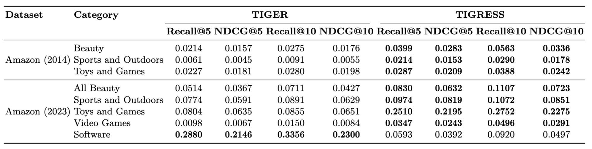

# 🐅 TIGRESS: Transformer Index for Generative Recommenders with Enhanced Semantic Signals


## 🧑‍💻 Team Members
- Aswin Krishna Mahadevan
- Meher Changlani  
- Mohammad Hafeez Khan  
- Udit Thakur  

## 👥 Supervising TAs
- Kidist Mekonnen (Main Supervisor)
- Akis Lionis (Co-supervisor)

## 🛠️ Setup and Installation

### 1. Create Environment

```bash
conda create -n rq-vae python=3.9
pip install -r requirements.txt
```

or using SLURM job

```bash
sbatch run job_scripts/install_enviroment.job
```

### 2. Weights & Biases (Optional)
Get your key from: [link](https://wandb.ai/authorize)
```bash
wandb login <API Key>
```

### 3. Run Training and Testing

```bash
python train_rqvae.py --config configs/rqvae_amazon.gin
python train_decoder.py --config configs/decoder_amazon.gin
```
or using SLURM job

```bash
sbatch run job_scripts/train_rqvae.job
sbatch run job_scripts/train_decoder.job
sbatch run job_scripts/test_decoder.job
```


## 📊 Weights & Biases Dashboard
- RQ-VAE Training Report: [link](https://wandb.ai/RecSys-UvA/rq-vae-training/reports/RQ-VAE-Training-Report--VmlldzoxMzM2NjQ5MA?accessToken=ycktjvkde9hfnfv7gz7zlkcjqtsl4pr2c1x3sy65megn49yebpi9nu3vwjzwcpt3)
- Decoder Training and Testing Report: [link](https://api.wandb.ai/links/RecSys-UvA/ofxtg8fq)
- Decoder Testing Only Report: [link](https://wandb.ai/RecSys-UvA/gen-ir-decoder-testing/reports/Decoder-Testing-Report--VmlldzoxMzM2NjQ1Mw?accessToken=r3cvpvonokw0kbslg5bt10kht3yf8chxhk7gjkpi2dt56wwaw9mstsn9qgwo2o96)
---

## 📁 High-Level Directory Structure

```bash
├── assets/                # Visuals used in paper/README (eg., plots, diagrams)
├── configs/               # Configuration files for RQ-VAE and decoder training
├── data/                  # Data loaders, preprocessing scripts, schema
├── evaluate/              # Evaluation metrics and logic
├── init/                  # Initialization strategies (e.g., KMeans)
├── job_scripts/           # SLURM job scripts for training and evaluation
├── metrics/               # Stored evaluation results (e.g., Recall, Fairness)
├── modules/               # Core model components (encoder, quantizer, transformer, etc.)
├── notebooks/             # Jupyter notebooks for analysis and preprocessing
├── ops/                   # Triton for jagged transformer integration
├── train_rqvae.py         # Script to train the RQ-VAE model
├── train_decoder.py       # Script to train the Transformer decoder
├── test_decoder.py        # Script to evaluate the decoder
├── requirements.txt       # Python dependencies
├── README.md              # Project overview and usage
├── REPRO.md               # Reproducibility checklist
└── RQ-VAE-README.md       # Notes specific to RQ-VAE implementation
```

## 🧾 Project Abstract
_Provide a concise summary of your project, including the type of recommender system you're building, the key techniques used, and a brief two sentence summary of results._

---

## 📊 Summary of Results


### Reproducability 

We evaluated the reproducibility of three models – SASRec, S³-Rec, and TIGER across three Amazon datasets: Beauty, Sports and Outdoors, and Toys and Games. Our findings are summarized below:

* **Performance drop**: Reproduced results are consistently lower than originally reported across all models and datasets.
* **Most reproducible**: SASRec showed the highest reproducibility among the three.
* **Significant gaps**: S³-Rec and TIGER had large performance discrepancies, especially on Sports and Outdoors.
* **Metric consistency**: Trends across Recall\@5/10 and NDCG\@5/10 remained generally consistent between original and reproduced runs.


*Comparison of original reported results and our reproductions across Recall and NDCG at cutoffs 5 and 10, for three categories and three models*

### Extensions

We implemented and evaluated several extensions to the original TIGER framework:

* **TIGRESS**: A multimodal extension of TIGER that fuses CLIP-based image embeddings with Sentence-T5 textual features before RQ-VAE quantization, improving semantic ID quality.
* **Fusion method**: Element wise addition outperformed concatenation, balancing dimensionality and semantic alignment.
* **Improved performance**: TIGRESS outperforms TIGER across Amazon (2014) categories up to 2.5x gain in Recall\@5 showing the benefit of visual semantic signals.
* **Amazon 2023 evaluation**: Introduced a large-scale, up-to-date benchmark (570M+ reviews, 33 categories) to test generalization.
* **Domain-specific gains**: TIGRESS excels in visually rich categories but underperforms in text-dominant domains like Software.
* **Fairness and diversity**: Added evaluation of exposure inequality and user fairness to assess beyond accuracy.


*Comparison of TIGER and TIGRESS on diversity metrics at cutoffs 5 and 10 across Amazon (2014) [2] and Amazon (2023) [3] datasets categories*

These extensions show that multimodal fusion enhances recommendation in visually informative domains while revealing limitations in others.

---

## 🛠️ Task Definition

We address a **generative retrieval-based recommendation** task in a **sequential** and **content-aware** setting. Following the TIGER [1] framework, the goal is to generate relevant item identifiers (semantic IDs) conditioned on a user’s interaction history.

* **Input**:
  A sequence of items previously interacted with by the user, represented as semantic IDs generated via RQ-VAE encoding of item metadata (e.g., title, brand, image, category, price).

* **Output**:
  A ranked list of semantic IDs representing recommended items, generated autoregressively using a Transformer-based decoder.

This approach enables open-ended, generative recommendation without relying on fixed candidate pools, and supports cold-start scenarios through content-based semantic ID generation.


---

## 📂 Datasets


- [Amazon 2014 [2]](https://jmcauley.ucsd.edu/data/amazon/index_2014.html)
  - Pre-processing: We used [P5 Pre-procesing](https://github.com/jeykigung/P5/blob/main/preprocess/data_preprocess_amazon.ipynb) pipeline to pre-process the data and keep users interactions having equal to and more than 5 reviews.
  - Categories considered: Beauty, Sports and Outdoors, Toys and Games
  - Attributes for user fairness: User Interaction History (Title, Brand, Categories, Price)
  - Attributes for item fairness: Title, Brand, Categories, Price
  - Other attributes: Product Images

- [Amazon 2023 [3]](https://amazon-reviews-2023.github.io/)
  - Pre-processing: Similar to the 2014 edition, we used [P5 Pre-procesing](https://github.com/jeykigung/P5/blob/main/preprocess/data_preprocess_amazon.ipynb) pipeline to pre-process the data and keep users interactions having equal to and more than 5 reviews.
  - Categories considered: All Beauty, Sports and Outdoors, Toys and Games, Video Games, Software
  - Attributes for user fairness: User Interaction History (Title, Brand, Categories, Rating, Price)
  - Attributes for item fairness: Title, Brand, Categories, Rating, Price
  - Other attributes: Product Images


*User interaction statistics for the Amazon 2014 [2] and Amazon 2023 [3] datasets.*

---

## 📏 Metrics

We evaluate models using both traditional recommendation metrics and extended fairness/diversity metrics to assess effectiveness and societal implications of generative retrieval.

* **Recall\@K**
  * **Description**: Measures the fraction of ground-truth relevant items that appear in the top-K generated recommendations.
  * **Why appropriate**: Captures the model’s ability to retrieve relevant items; essential for evaluating relevance in top-k retrieval scenarios.

* **NDCG\@K (Normalized Discounted Cumulative Gain)**
  * **Description**: Measures ranking quality by rewarding correct recommendations higher in the list with logarithmic discounting.
  * **Why appropriate**: Reflects user experience more accurately than Recall by penalizing misordering of relevant items.

* **Item Coverage\@K**
  * **Description**: Proportion of unique catalog items recommended across all users.
  * **Why appropriate**: Measures diversity at the catalog level and assesses how widely the system explores the item space.

* **Brand Coverage\@K**
  * **Description**: Proportion of unique brands represented in recommendations.
  * **Why appropriate**: Detects brand-level diversity and prevents concentration on a few dominant brands.

* **Gini Coefficient (Exposure Inequality)**
  * **Description**: Measures inequality in item exposure across the catalog; lower values indicate fairer exposure.
  * **Why appropriate**: Identifies systemic popularity bias that can harm catalog diversity and niche item visibility.

* **Relative Disparity\@K**
  * **Description**: Measures fairness across user groups (light, medium, heavy activity) by comparing group-level performance.
  * **Why appropriate**: Ensures that the recommendation quality is equitable across varying user engagement levels.

Each metric is selected to assess different dimensions of system quality: relevance, diversity, exposure fairness, and user equity.

---

## 🔬 Baselines & Methods


We compare against three sequential recommendation models for reproducibility and benchmarking. For TIGRESS, we focus on comparison with TIGER.

### Baselines

- **SASRec [4]**: A transformer-based sequential recommender that uses self-attention to model user-item interaction sequences. Serves as a strong baseline for modeling user preferences via item embeddings.

- **S³-Rec [5]**: Builds upon SASRec by introducing self-supervised learning objectives using mutual information maximization, enhancing robustness and performance in sparse data settings.

- **TIGER [1]:** A generative retrieval framework that learns to generate relevant item identifiers directly from user context, integrating a language modeling paradigm into recommendation tasks. Used as the main baseline to evaluate our proposed TIGRESS model.

### Primary Method

- **TIGRESS** (ours)  
  A hybrid generative retrieval model that extends TIGER by incorporating richer semantics through multimodal representations and prompt-guided generation. Designed to improve both accuracy and diversity/fairness in recommendations.

### Frameworks Used

All models are implemented using **PyTorch**, and we follow original implementations when available to ensure reproducibility.

- SASRec: [link](https://github.com/pmixer/SASRec.pytorch)  
- S³-Rec: [link](https://github.com/RUCAIBox/CIKM2020-S3Rec)
- TIGER: [link](https://github.com/EdoardoBotta/RQ-VAE-Recommender)


### 🧠 High-Level Description of Method

**Pipeline Overview**  
1. **Data Input**: We use the Amazon 2014 and 2023 dataset with product metadata (title, brand, category, price) and product images. 
    - We adopt the **Leave-Last-Out** splitting strategy.
    - For each user interaction sequence:

      - The **last item** is used for **testing**.
      - The **second-to-last item** is used for **validation**.
      - All **preceding items** are used for **training**.
    - During training, each user history is truncated to a **maximum of 20 items**.

2. **Embedding**:  
   - Text features are encoded using Sentence-T5-XL.  
   - Image features are extracted using CLIP (ViT-L/14 backbone).  
   - Text and image embeddings are fused via element-wise addition.  
3. **Quantization**: The fused representation is passed through an RQ-VAE to generate compact semantic IDs.  
4. **Prediction & Ranking**: The decoder, a Transformer model, generates item predictions conditioned on user sequences and ranks retrieved candidates based on semantic ID similarity.

**Model Components**  
- **RQ-VAE**: 3-layer residual quantizer with hidden dims [512, 256, 128], latent dim 32, and codebook size 256 (shared with the decoder).  
- **Decoder**: Transformer with 8 attention heads and embedding dim 512.  
 

**Implementation & Training**  
- Based on [RQ-VAE Recommender](https://github.com/EdoardoBotta/RQ-VAE-Recommender), adapted for Amazon 2023.  
- Data preprocessing follows [P5 pipeline](https://github.com/jeykigung/P5/blob/main/preprocess/data_preprocess_amazon.ipynb).  
- Image embeddings are computed and cached during training via [CLIP](https://github.com/openai/CLIP).  
- Training and logging handled via PyTorch and [Weights & Biases](https://wandb.ai/).  

**Hyperparameters**  
- **Decoder**: 200K iterations, LR=0.0003, batch size=256, 10K warm-up steps.  
- **RQ-VAE**: 400K iterations, LR=0.0005, batch size=64.  
- Optimizer: AdamW with inverse square root scheduler (decoder only).  


---

## 🌱 Proposed Extensions

We extend the original TIGER framework along three main directions:

1. **Multimodal Generative Retrieval (TIGRESS)**  
   TIGRESS integrates CLIP-based (ViT-L/14) image embeddings with Sentence-T5-XL text embeddings using element-wise addition before RQ-VAE quantization. This fusion enhances semantic ID generation, improving performance in visually driven categories and utlising cross modality alliance.

2. **Evaluation on Amazon 2023**  
   We benchmark TIGRESS on the large-scale Amazon 2023 dataset (570M+ reviews across 33 categories), extending evaluation beyond the original Amazon 2014 split. This allows us to assess generalization to contemporary e-commerce trends and product diversity.

3. **Fairness and Diversity Metrics**  
   Beyond accuracy metrics (Recall/NDCG), we include fairness and diversity evaluation to measure user-level equity and content diversity, addressing concerns around recommendation bias and overexposure (covered under Metrics section). 

Compared to recent multimodal generative models like MMGRec [6] and MQL4GRec [7], TIGRESS focuses on lightweight yet effective enhancement of hierarchical semantic ID generation using visual signals, without relying on graph quantization or full unified language modeling.


## 📚 References

[1] Rajput, S., Mehta, N., Singh, A., Keshavan, R. H., Vu, T., Heldt, L., … Sathiamoorthy, M. (2023). Recommender Systems with Generative Retrieval. arXiv [Cs.IR]. Retrieved from http://arxiv.org/abs/2305.05065  

[2] McAuley, J., Targett, C., Shi, Q., van den Hengel, A.: Image-based recommendations on styles and substitutes (2015), https://arxiv.org/abs/1506.04757  

[3] Hou, Y., Li, J., He, Z., Yan, A., Chen, X., McAuley, J.: Bridging language and items for retrieval and recommendation. arXiv preprint arXiv:2403.03952 (2024)  

[4] Kang, W.C., McAuley, J.: Self-attentive sequential recommendation. In: 2018 IEEE International Conference on Data Mining (ICDM). pp. 197–206. IEEE (2018), https://arxiv.org/abs/1808.09781  

[5] Kang, W.C., McAuley, J.: Self-attentive sequential recommendation. In: 2018 IEEE International Conference on Data Mining (ICDM). pp. 197–206. IEEE (2018), https://arxiv.org/abs/1808.09781  

[6] Liu, H., Wei, Y., Song, X., Guan, W., Li, Y.F., Nie, L.: Mmgrec: Multimodal generative recommendation with transformer model (2024), https://arxiv.org/abs/ 2404.16555  

[7] Zhai, J., Mai, Z.F., Wang, C.D., Yang, F., Zheng, X., Li, H., Tian, Y.: Multimodal quantitative language for generative recommendation (2025), https://arxiv.org/ abs/2504.05314